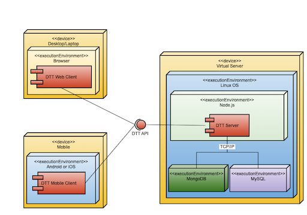

# Application Development II Semester Project
## DUCS Time Tracker (DTT)
## Spring Semester 2021

## Preface
This repo is derived from the previous repo owned by my professor, Dr. Sigman. I wanted to make a new repo with my code copied over that is separate from him and my university. This is my project and my code that spanned over 7 sprints and 3 months. I just wanted a fresh repo that is owned and managed by only me.

## Overview

The *DUCS Time Tracker (DTT)* project is a web/mobile app that supports Drury Math & Computer Science courses that require students to record the time they spend on a course project.  The application will allow student to easilty record the time they spend working on projects in their classes.  It will also allow instructors to easily 
create weekly time sheets for use in recording grades.  The functionality of the app is defined in the following set of user stories.

## Requirements

In software development we define the requirements for a software product in terms of stories about how the users will use the system, which are referred to as user stories. The complete list of user stories for a product is known as the backlog. The backlog for the *DTT* system follows:

*Note:* Each user story start with a name for the story in *italics* followed by a colon.  The actor of the story will appear in ***bold italics***.  The first underlined clause indicates what the user wants to do with the product (the functionality).  The second underlined clause indicates reason the actor wants the indicated functionality.

*Record Work Session:* As a ***student*** I want to <span style="text-decoration: underline">record the time I worked on the project on a work session by session basis </span> so that <span style="text-decoration: underline">I have the freedom to record my daily work on a project at multiple times during a day</span>.

*Authenticate User:* As an ***instructor*** I want <span style="text-decoration: underline">students to have to authenticate themselves before recording a worksession</span> so that <span style="text-decoration: underline">I can comply with the law regarding the privacy of student grades</span>.

*View Weekly Time Card:* As a ***student*** <span style="text-decoration: underline">I want to be able to view my weekly time card</span> so that <span style="text-decoration: underline">I can review the project work time I have recorded</span>.

*Edit Time Card:* As a ***student*** I want to be able to <span style="text-decoration: underline">edit my time card prior to submitting the card</span>so that <span style="text-decoration: underline">I can correct mistakes I made recording work sessions</span>.

*Submit Time Card:* As an ***instructor*** I want <span style="text-decoration: underline">students to submit their time cards before a deadline
each week</span> so that <span style="text-decoration: underline">student time cards do not change after I review them<span>.

*Search Time Cards:* As a ***student*** I want to be able to <span style="text-decoration: underline">search my submitted time cards by week</span>
so that <span style="text-decoration: underline">I can review how I recorded an activity on a previous card</span>.

*Explore Time Cards:* As an ***instructor*** I want to be able to  <span style="text-decoration: underline">search all time cards for a project by
week</span> so that  <span style="text-decoration: underline">I can review the cards submitted by students for that week</span>.

*Assign Teams:* As an ***instructor*** I want to be able to  <span style="text-decoration: underline">assign students to a team</span> so that  <span style="text-decoration: underline">I can
manage the time a team works on a project</span>.

*Review Team Reports:* As an ***instructor*** I want to be able to <span style="text-decoration: underline">view student time cards by team</span> so
that <span style="text-decoration: underline">I can analyze a team’s work on a project</span>.

*View Class Report:* As an ***instructor*** I want to be able to <span style="text-decoration: underline">view a report of time cards for a project</span> so that<span style="text-decoration: underline">I can record time worked on the project in my grade book</span>.

*Manage Multiple Classes:* As an ***instructor*** I want to be able to <span style="text-decoration: underline">manage time cards for multiple
classes</span> so that <span style="text-decoration: underline">I can use time cards in more than one class</span>.

*Export Time Data:* As an ***instructor*** I want to be able to <span style="text-decoration: underline">export time card data for a range of
dates</span> so that <span style="text-decoration: underline">I can analyze student work on projects</span>.

## Initial Design



## DTT API 

API functions added as created in each Sprint.


## Sprint 1

### Objective

The objectives of Sprint 1 are:
*  Create basic UI for phone, tablet, and desktops.
*  Create and implement an authentication API.
*  Implement user sign in for students using the authentication API.

### User Story

*Authenticate User:* As an ***instructor*** I want <span style="text-decoration: underline">students to have to authenticate themselves before recording a worksession</span> so that <span style="text-decoration: underline">I can comply with the law regarding the privacy of student grades</span>.

### Tasks

| Task                                                                    | Completion Date |
| ----------------------------------------------------------------------- | :-------------: |
| Create server.js that serves static pages from the public directory.    | 12/30/2020      |
| Create a static landing page with login widget & test. (index.html)     |  1/16/2021      |
| Define an authentication API.                                           |  1/17/2021      |
| Define the User Mongoose schema for a MongoDB database.                 |  1/17/2021      |
| Create a user document & users schema in MongoDB database: ducs_tra.    |  1/17/2021      |
| Implement a database connection (in db.js) using Mongoose & test.       |  1/17/2021      |
| Implement the authentication API as a route & test. (clear text only)   |  1/17/2021      |
| Implement login using the authentication API.                           |  1/18/2021      |


## Sprint 2

### Objective

The objective of sprint 2 is to allow a student to record a project time session.

### User Story

*Record Work Session:* As a ***student*** I want to <span style="text-decoration: underline">record the time I worked on the project on a work session by session basis </span> so that <span style="text-decoration: underline">I have the freedom to record my daily work on a project at multiple times during a day</span>.

### Work Session Data

Data structure of a work session element is:

```
{
    date:  Date(),   // the date the session is recorded - default current date
    start: time,     // the start time of session - in 24 hour format
    finish: time,    // finsih time - in 24 hour format
    code:   number,  // classification code for activity type - values below
    other:  string,  // activity code name for - other (optional)
    activity: string // descritpion of the session activity
}
```
Code values:

*  10 - Requirements
*  20 - Analysis
*  30 - Design
*  40 - Implementation
*  50 - Testing
*  60 - Planning
*  70 - Evaluation
*  80 - Research
*  90 - Other

### Tasks

| Task                                                                    | Completion Date |
| ----------------------------------------------------------------------- | :-------------: |
| Create a UI element for recording a worksession                         |  1/19/2021      |
| Create a Mongoose schema for a project.                                 |  1/20/2021      |
| Create a Mongoose schema for a worksession.                             |  1/20/2021      |
| Modify user schema to include projects.                                 |  1/20/2021      |
| Implement the projects and wk-sessions collections in the ducs_tra db.  |  1/25/2021      |
| Design the API for saving wk-sessions.                                  |  1/25/2021      |
| Design the API for retrieving a user's projects.                        |  1/25/2021      |               
| Implement the wk-session & project APIs as a routes and test.           |  1/25/2021      |
| Implement saving work sessions from the UI and test.                    |                 |


## Sprint 3

### Objective

The objective of sprint 3 is to allow an instructor to easily record grades for a project.

### User Story

*View Class Report:* As a ***instructor*** I want to be able to <span style="text-decoration: underline">view a report of time cards for a project</span> so that <span style="text-decoration: underline">I can record time worked on the project in my grade book</span>.


### UI Notes

The main page that an instructor lands on will be the project reporting page.  This page will allow an instructor to choose a project and the starting date of reporting week.  The starting date will default to the Sunday of the current week.  The report generated from this information will show the project name the starting date and ending date of the report and one line for each student working on the project. Each student line will have the student's name and the total hours they recorded on their time card for the week.  Clicking on a student line will bring up a detailed time card for the student in a modal popup.

### Example Time Sheet

```
Name: Jane Doe	             Week: 7/24/2020 to 7/30/2020
Project: Drury Arbor Map	 Total Hours Worked: 2.5

Date	Start	            Finish	   Time	   Code	   Activity
7/24	9:30 a.m.	 11:00 a.m.	   1.5	    60	    Class: team meeting to prepare for client interview
7/25	1:00 p.m. 	 2:00 p.m.	   1.0	    10	    Meeting with client
```

### Tasks

| Task                                                                    | Completion Date |
| ----------------------------------------------------------------------- | :-------------: |
| Create design for the project reporting page.                           |  2/4/2021       |
| Implement the design for the project reporting page.                    |  2/4/2021       |
| Design a API to retrieve the time worked by all members of a project    |  2/12/2021      |
|  for a given week                                                       |                 |
| Implement the API to retrieve the time worked by all members of a       |  2/15/2021      |
|  project as a route.                                                    |                 |
| Test the API to retrieve the time worked by all members of a            |  2/15/2021      |
|  project as a route using Postman.                                      |                 |
| Design the popup time sheet report of a student.                        |  2/16/2021      |
| Define an API to return a time sheet given an email, project code,      |  2/17/2021      | 
|   and the first day of a week.                                          |                 |
| Implement the time sheet API call as a route.                           |  2/17/2021      |
| Test the time sheet API call using Postman.                             |  2/17/2021      |
| Implement the popup report in the UI.                                   |  2/17/2021      |


## Sprint 4

### Objective

The objective of Sprint 4 is to implement a token based login process and to ensure that only encrypted passwords are stored in the database.

### User Story

Authenticate User: As an instructor I want students to have to authenticate themselves before recording a work session so that I can comply with the law regarding the privacy of student grades.

(*New*) Authenticate All Users: As a sys admin I want all users of the system to have to have to authenticate themselves before they access application functions so that I can protect user's data and prevent misuse of the application.

### Tasks

| Task                                                                    | Completion Date |
| ----------------------------------------------------------------------- | :-------------: |
| Modify the api/auth route to return a JWT token when the user           |  2/22/2021      |
| is successfully authenticated.                                          |                 |
| Modify the UI to save the JWT token in local storage.                   |  2/22/2021      |
| Design an api for creating users.                                       |  2/22/2021      |
| Implement the api for creating users using bcrypt encrypted passwords.  |  2/23/2021      |
| Test the api using Postman.                                             |  2/23/2021      |
| Regenerate the user collection using the new route with Postman.        |  2/22/2021      |


## Sprint 5

### Objective

The objective of sprint 5 is to use sessions to improve the efficiency of the process of creating the instructor's project time report.

### User Story

Authenticate User: As an instructor I want students to have to authenticate themselves before recording a work session so that I can comply with the law regarding the privacy of student grades.

(*New*) Authenticate All Users: As a sys admin I want all users of the system to have to have to authenticate themselves before they access application functions so that I can protect user's data and prevent misuse of the application.

### Tasks

| Task                                                                    | Completion Date |
| ----------------------------------------------------------------------- | :-------------: |
| Adapt the route for the api call to return the project time report,     |  3/20/2021      |
| api/wsession?p=pp&d=dd, to save the worksessions for each student that  |                 |
| fall in the correct date range in a seassion variable(s).               |                 |
| Test modified route using Postman.                                      |  3/20/2021      |
| Use document.cookie to add the worksessions for a student to the time   |  3/20/2021      |
| card report for a student.                                              |                 |
| Adapted the modal to retrieve data from the cookie instead of making    |  3/24/2021      |
| another API call.                                                       |                 |


## Sprint 6

### Objective

Objective of this sprint is to create a MySQL database and use the database to support user functionality for 1) creating a user, and 2) authenticating a user (ie. logging in).


### User Story

Authenticate User: As an instructor I want students to have to authenticate themselves before recording a worksession so that I can comply with the law regarding the privacy of student grades.

Authenticate All Users: As a sys admin I want all users of the system to have to have to authenticate themselves before they access application functions so that I can protect user's data and prevent misuse of the application.


### Tasks

| Task                                                                    | Completion Date |
| ----------------------------------------------------------------------- | :-------------: |
| Create a relational database design for the DTT system.                 |  4/10/2021      |
| Normalize the relational database design.                               |  4/14/2021      |
| Create the test database from my design at mcs.drury.edu.               |  4/21/2021      |
| Alter the authentication route to use the database at                   |  4/24/2021      |
| mcs.drury.edu to authenticate users.                                    |                 |
| Alter the create users route to use the database at                     |  4/25/2021      |
| mcs.drury.edu to authenticate users.                                    |                 |


## Sprint 7

### Objective

Objective of this sprint is to give the view/edit time cards button on the student's page two functionalities 1) Being able to view that student's current time cards 2) Being able to select a time card and change/edit part(s) of it.
Also, improve feedback system and allow user to sign out of the application.

### User Story

View Weekly Time Card: As a student I want to be able to view my weekly time card so that I can review the project work time I have recorded.

Edit Time Card: As a student I want to be able to edit my time card prior to submitting the card so that I can correct mistakes I made recording work sessions.

Sign out: As a student I want to be able to sign out of my account so that I can safely exit the application.


### Tasks

| Task                                                                    | Completion Date |
| ----------------------------------------------------------------------- | :-------------: |
| Create new modal for students to view and edit their timecards.         |  5/4/2021       |
| Create an API to populate the modal with that student's timecards.      |  5/4/2021       |
| Allow student to select time card on modal and that time card data      |  5/5/2021       |
| populate the reporting page.                                            |  5/5/2021       |
| Add new button to save edited time cards.                               |  5/5/2021       |
| Create new API for when the edit button is clicked to update the        |  5/7/2021       |
| selected time card with updated information.                            |                 |
| Add sign out function to existing sign out button.                      |  5/8/2021       |
| Add feedback for when a user fails a log in.                            |  5/8/2021       |
| Add feedback for when a user successfully saves a time card.            |  5/8/2021       |
| Add feedback for when a user successfully edits a time card.            |  5/8/2021       |


